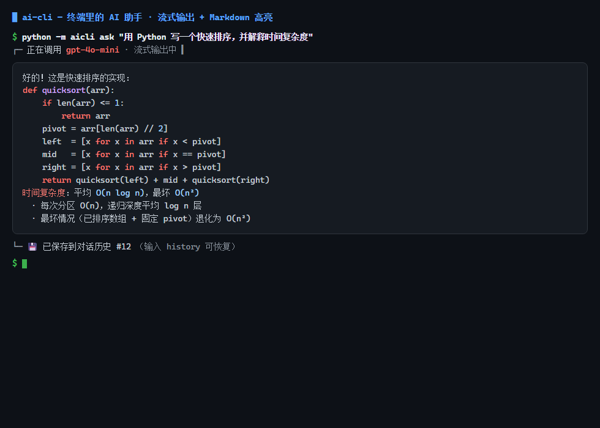
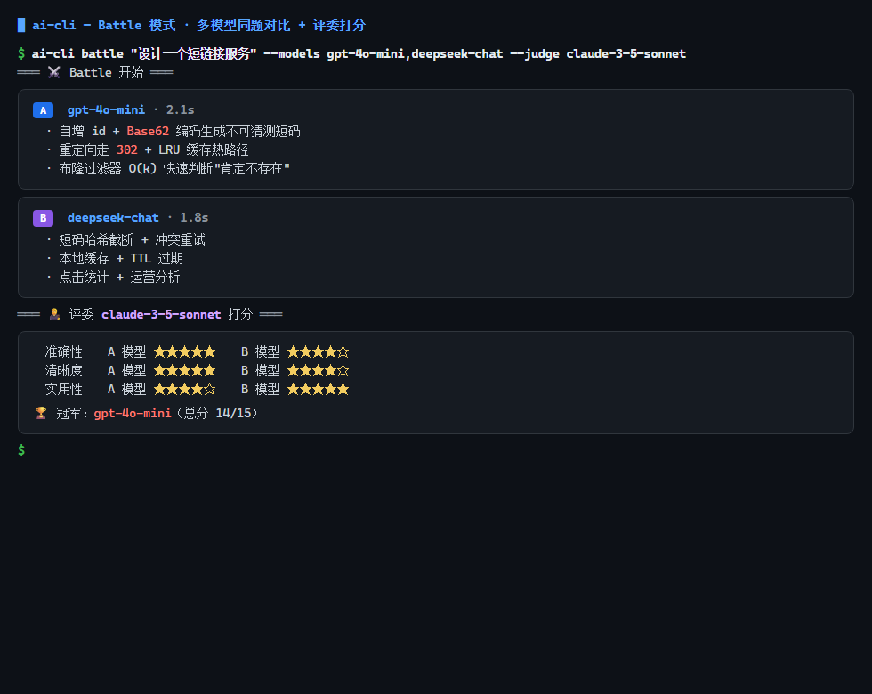

<div align="center">

```
   _____  _____   ______ __     __
  /  _  \|  _  \ /  ___/|  \   /  |
 /  /_\  \  / \  |  |___ |   \_/   |
/  |_|  \  | |  |\___  \|   _   _  |
\  \___/  \__|__/ ___|  ||  | | |  |
 \______/         \____/ |__| |_|__|

   终端里的 AI 助手 · 零依赖 · 一条命令开聊
```

# 🤖 ai-cli

**把 ChatGPT 塞进你的终端。** 零第三方依赖、支持任意 OpenAI 兼容 API、流式输出、多轮对话自动保存 —— `clone` 即用,30 秒上手。

| 日常问答 | 多模型 Battle 对比 |
|---|---|
|  |  |

[](https://www.python.org)
[](requirements.txt)
[](https://github.com/bixinlei/ai-cli/actions)
[](LICENSE)
[](#)
[](#贡献)
[](https://github.com/bixinlei/ai-cli)

> 🚀 **开箱即用** · 🧩 **兼容万物** · ⚡ **丝滑流式** · 💾 **记忆历史** · 🎨 **高颜值终端**

---

**中文** | [English](README.en.md)

</div>

## ✨ 为什么选择 ai-cli?

| | ai-cli | 其他 CLI 工具 |
|---|---|---|
| 🪶 **第三方依赖** | **零依赖**,Python 标准库搞定 | 通常要装 10+ 个包 |
| 🌐 **服务商** | 任意 OpenAI 兼容 API 通吃 | 往往绑定单一厂商 |
| 💬 **多轮对话** | 自动保存 + 一键恢复 | 很多不支持 |
| ⚡ **流式输出** | 逐字显示,实时体验 | 等待转圈 |
| 🥊 **多模型 Battle** | 同题对比 + 评委评分,一眼选出最强模型 | 几乎没有 |
| 🎨 **Markdown 高亮** | 零依赖 ANSI 渲染,代码块/标题/加粗全支持 | 需要额外依赖 |
| 📦 **体积** | ~50KB,轻到没朋友 | 动辄 MB 级 |
| 🔧 **可脚本化** | `ai-cli ask "翻译: hello"` | 难以集成 |

## 🚀 30 秒快速开始

```bash
# 1. 克隆
git clone https://github.com/bixinlei/ai-cli.git && cd ai-cli

# 2. 配 key(任选其一)
python -m aicli config set api_key sk-xxxx     # 写入配置文件
export AI_CLI_API_KEY=sk-xxxx                  # 环境变量(macOS/Linux)
$env:AI_CLI_API_KEY = "sk-xxxx"                # 环境变量(Windows)

# 3. 开聊!
python -m aicli ask "用一句话解释什么是递归"
```

## 🥊 Battle 模式(全新!)

**让多个模型同台竞技,评委打分,一眼选出最强答案:**

```bash
# 多模型同题对比
ai-cli battle "用 Python 写一个快排" --models gpt-4o-mini,deepseek-chat,qwen-plus

# 加一个评委模型,对全部回答评分
ai-cli battle "设计一个 REST API" --models gpt-4o-mini,deepseek-chat --judge claude-3-5-sonnet

# 或把默认对比阵容写进配置
ai-cli config set models '["gpt-4o-mini","deepseek-chat"]'
```

每个模型流式输出各自答案;带 `--judge` 时,评委模型会从**准确性 / 清晰度 / 实用性**三维度打分并选出冠军。

## 🎨 Markdown 高亮

**零依赖**的语法着色输出 —— 标题、加粗、行内代码、代码块、引用、列表:

```bash
ai-cli ask "用代码示例解释 async/await 的原理" --md
```

> 纯 ANSI 转义实现,不引入任何依赖;输出被重定向/管道时自动回退为纯文本。

## 🎬 现场演示

```text
❯ python -m aicli chat

[恢复会话 'default' 共 6 条消息]
输入 /quit 退出, /new 清空历史, /model 切换模型, /help 查看帮助
════════════════════════════════════════════════════
❯ You:  用 Python 写一个斐波那契数列
AI:    可以!这是迭代版本:

        def fib(n):
            a, b = 0, 1
            for _ in range(n):
                a, b = b, a + b
            return a

        时间复杂度 O(n),空间复杂度 O(1)。需要递归版或生成器版吗?
❯ You:  生成器版,并解释 yield 的作用
AI:    生成器版如下:...
```

## 🧩 兼容服务商(任意 OpenAI 格式 API)

| 服务商 | base_url | 推荐模型 |
|---|---|---|
| 🌟 **OpenAI** | `https://api.openai.com/v1`(默认) | `gpt-4o-mini` |
| 🐋 **DeepSeek** | `https://api.deepseek.com/v1` | `deepseek-chat` |
| 🌸 **通义千问** | `https://dashscope.aliyuncs.com/compatible-mode/v1` | `qwen-plus` |
| 🚀 **Kimi** | `https://api.moonshot.cn/v1` | `moonshot-v1-8k` |
| 🧠 **智谱 GLM** | `https://open.bigmodel.cn/api/paas/v4` | `glm-4-flash` |
| 🔓 **Ollama(本地!)** | `http://localhost:11434/v1` | `qwen2.5:7b` |

> 💡 任何兼容 OpenAI 的 API 都能接,包括本地部署的 Ollama / vLLM / LM Studio —— **免费模型也能玩!**

```bash
# 一键切换到 DeepSeek
python -m aicli config set base_url https://api.deepseek.com/v1
python -m aicli config set model deepseek-chat
```

## 📖 命令手册

| 命令 | 功能 |
|---|---|
| `ai-cli ask "问题"` | 💨 单次提问(不保存,适合脚本) |
| `ai-cli battle "问题" --models a,b` | 🥊 多模型同题对比,可选评委评分 |
| `ai-cli chat` | 💬 交互式多轮对话(自动保存) |
| `ai-cli chat -s work` | 🗂️ 多会话管理,工作/生活分开 |
| `ai-cli history list` | 📜 查看全部历史会话 |
| `ai-cli history show <会话>` | 🔍 回看某次对话 |
| `ai-cli config show` | ⚙️ 查看配置 |
| `ai-cli config set <key> <value>` | 🛠️ 修改配置 |

**chat 模式内置命令**:`/quit` 退出 · `/new` 清空 · `/model <名称>` 秒切模型 · `/help` 帮助

**常用参数**:
```bash
ai-cli ask "写段冒泡排序" --model deepseek-chat    # 临时换模型
ai-cli chat --no-stream                           # 关闭流式
ai-cli ask "你好" --base-url https://api.deepseek.com/v1  # 临时换服务商
```

## ⚙️ 配置优先级

```
命令行参数  >  环境变量(AI_CLI_*)  >  配置文件(~/.aicli/config.json)
```

配置文件字段:`api_key` / `base_url` / `model` / `temperature` / `system_prompt`

## 🧪 自带测试,离线可跑

```bash
python -m unittest discover -s tests -v
# 8 tests ... OK  ← 内置 mock 服务器,无需真实 API
```

## 📁 项目结构

```
ai-cli/
├── aicli/                  # 🧠 核心代码
│   ├── cli.py              #    命令行与交互逻辑
│   ├── client.py           #    OpenAI 兼容客户端(SSE 流式解析)
│   ├── config.py           #    三级配置优先级
│   ├── console.py          #    彩色输出 + Windows VT 支持
│   ├── md_render.py        #    🆕 零依赖 Markdown 高亮渲染
│   └── history.py          #    JSONL 会话存储
├── tests/test_e2e.py       # 🧪 端到端测试(mock 服务器)
├── .github/workflows/ci.yml# 🤖 自动测试
├── README.md               # 📖 中文文档
├── README.en.md            # 📖 🆕 英文文档
└── LICENSE                 # 📄 MIT
```

## ❓ FAQ

**Q: 需要注册 OpenAI 账号吗?**
不用!接 DeepSeek / Kimi / 通义千问等国内服务商,或用 Ollama 跑本地模型,完全免费。

**Q: 真的零依赖吗?**
真的。只用 Python 标准库,`pip` 都不用装,`clone` 下来直接 `python -m aicli`。

**Q: 支持 Windows 吗?**
全平台支持,Windows 的彩色输出也已通过 VT 模式兼容(测试过)。

**Q: 对话存在哪里?会不会泄露隐私?**
存在本机 `~/.aicli/history/` 下,JSONL 明文,不会上传。请勿把 key 提交到仓库。

**Q: 如何全局使用?**
```bash
pip install .                # 安装后可用 ai-cli 命令
alias ai='python -m aicli'   # 或设置别名
```

## 🤝 贡献指南

欢迎一切贡献!只需:

1. Fork 本仓库 → 新建分支
2. 提交改动(附测试)
3. 发起 Pull Request

想加的功能(issue 见 [这里](https://github.com/bixinlei/ai-cli/issues)):
- [ ] Markdown 渲染输出
- [ ] 多模型对比(battle 模式)
- [ ] 会话导出/导入(JSON/Markdown)
- [ ] 流式打字机音效 🎵

## 📄 许可证

[MIT License](LICENSE) © 2025 bixinlei

---

<div align="center">

### ⭐ 如果这个工具帮到了你

**点个 Star 是对开源作者最好的支持!**

[](https://github.com/bixinlei/ai-cli)

你的每一次 Star,都会让这个项目被更多人看到 ✨

</div>
